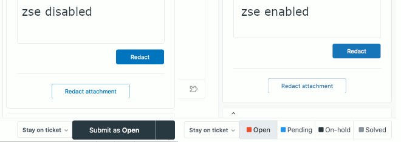

# zendesk-submit-expander
A browser extension to replace the default Zendesk ticket submission drop-up with a button group instead to save 1 click per ticket.

## Installation
#### Chrome
You can install the latest version [manually](https://github.com/frogamic/zendesk-submit-expander/releases), or from the [Chrome Web Store](https://chrome.google.com/webstore/detail/zendesk-submit-expander/hpocmjkijiifppldckmofghmhjmmmcdk).

#### Firefox
You can install the latest version [manually](https://github.com/dtf0/zendesk-submit-expander/releases), or from the [Firefox Add-ons web site](https://addons.mozilla.org/addon/zendesk-submit-expander/).
